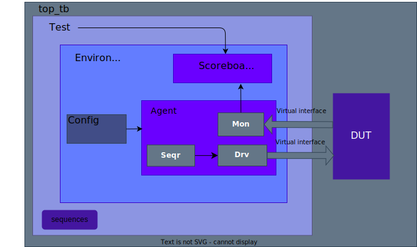

# UVM-Jumpstart
 This repo gives a quick practical introduction to UVM. It is stressing the UART transmitter & receiver side, and it gives a basic implementation of the UVM infrastructure. It works with Microchip's Modelsim free version. There is no need to have compiled UVM libraries. Design,simulation, and UVM libraries are compiled through ".do" file located under "run" folder. All the work has been realized in Ubuntu operating system.
 
 ### :zap: Key Features
- Configurable Reset Polarity
- Configurable Parity settings
- Configurable Stop bit settings
- Data error detection (expected vs actual)



### Comply with the below steps to checkout repo and submodules

```
 git clone --recurse-submodules https://github.com/Purdue-SoCET/UVM-Jumpstart.git
```
### After checking out the repo, please follow the steps below to complie design and verification files

```
 cd UVM-Jumpstart/run
 vsim -c -do run.do
```
## UVC integration

- Include interface and package files on your top-level testbench module:
```verilog
`include "uart_if.svh"
`include "verif_pkg.svh"
...
module top_tb
...
```
- Import verification package (environment, scoreboard, test) and uvm package:
```verilog
 module top_tb
 ...
 import uvm_pkg::*;
 import verif_pkg::*;
```
- Instantiate the interface on your top-level testbench module, drive the reset and clock signals:
```verilog
 uart_if uart_if_inst(
 .resetn_i   (resetn_i),
 .clock_i    (clock_i)
 );
```
- Connect interface to DUT:
 ```verilog
  uart  uart_rx_CHIPKIT_inst(
 .clk        (uart_if_inst.clock_i)     ,
 .rstn       (uart_if_inst.resetn_i)    ,
 ...
 .rx_err     ()
);
```
- Register the interface as virtual interface to uvm_config_db and call run_test:

```verilog
 initial
 begin
 // Setting interfaces to uvm_config_db
 // config_db get is done in env_top class
 uvm_config_db #(virtual uart_if)::set(null,"*","uart_vif",uart_if_inst);
 // Execute UVM test class
 run_test();
 end
```
- Handle the agent configuration class, agent class, and scoreboard class in your environment class:
```verilog
 class env_top extends uvm_env;
 // UVM macro Factory registration
 `uvm_component_utils(env_top)
 // Instantiate UART agent and settings
 uart_config uart_agent_config_h;
 uart_agent h_uart_agent;
// Instantiate UART scoreboard
uart_scoreboard uart_scoreboard_h;
```
- Construct the agent configuration, agent, and scoreboard in in build_phase (environment class):
```verilog
 function void env_top::build_phase(uvm_phase phase);
 super.build_phase(phase);
...
 // Construct config class
 uart_agent_config_h = uart_config::type_id::create("uart_agent_config_h", this);
 // Construct agent class
 uart_agent_h = uart_agent::type_id::create("uart_agent_h",this);
// Construct scoreboard class
uart_scoreboard_h = uart_scoreboard::type_id::create("uart_scoreboard_h",this);
```
- Get the virtual interface from uvm_config_db and assign to the vif in the agent config class in build_phase (environment class):
```verilog
 function void env_top::build_phase(uvm_phase phase);
 super.build_phase(phase);
...
 // Get virtual interfaces, which is set by top_tb, from config_db
 if(!uvm_config_db #(virtual uart_if)::get(this, "", "uart_vif", uart_agent_config_h.vif)) begin
 VIF_FATAL: `uvm_fatal("VIF CONFIG","cannot get uart_vif from uvm_config_db")
 end
```
- Set the configuration parameters to uvm_config_db in build_phase (environment class):
```verilog
 function void env_top::build_phase(uvm_phase phase);
 super.build_phase(phase);
...
 // Set the config paramaeters (baud, parity, reset poloarity. etc) of the agent
 // config_db get is done in uart_agent class
 uvm_config_db #(uart_config)::set(this,"uart_agent_h", "uart_config", uart_agent_config_h);
 // config_db get is done in uart_scoreboard class
 uvm_config_db #(uart_config)::set(this,"uart_scoreboard_h", "uart_config", uart_agent_config_h);
 end
```
- Connect monitor to scoreboard in connect_phase (environment class):
```verilog
function void env_top::connect_phase (uvm_phase phase); 
 // Connecting the monitor's analysis ports with uart_scoreboard's expected analysis exports.
 uart_agent_h.monitor_h.monitor_port.connect(uart_scoreboard_h.observed);  
endfunction:connect_phase
```
- Set parameters for your agent:
```verilog
 uart_agent_config_h.baud_rate          = 115_200            ;
 uart_agent_config_h.number_data_bits   = EIGHT_WIDTH        ;
 uart_agent_config_h.reset_polarity     = ACTIVE_LOW         ;
 uart_agent_config_h.stop_bit           = STOP_BIT_TWOBITS   ;
 uart_agent_config_h.parity_bit         = PARITY_NONE        ;
```
- All set! :star:

## To generate additional tests
- Go to ./enviroment/verif_pkg.svh, and include your new testcase  `include "../test/your_new_testcase.svh"
```verilog
package verif_pkg;

 import uvm_pkg::*;
 import uart_pkg::*;

 `include "uvm_macros.svh"
    
 `include "../environment/uart_scoreboard.svh"
 `include "../environment/env_top.svh"
 `include "../test/test_top.svh"
 `include "../test/tc_direct_urx_utx.svh"
 `include "../test/your_new_testcase.svh"

endpackage
```
- After including your new test case, go to ./run/do.run
```shell
...
set uvm_test        your_new_testcase           ;   # UVM testname
...
```
- It is ready to stress the design with new test case! :star:
